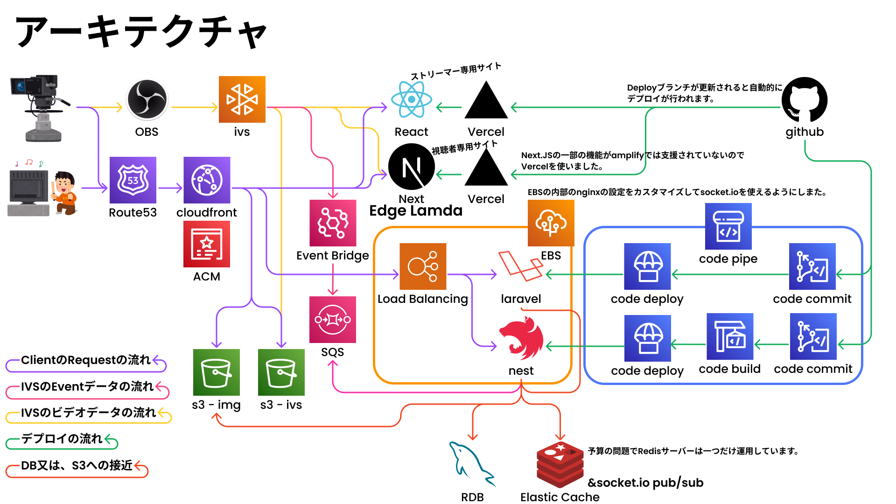

# Miko

インタラクティブな体験型コンサートストリーミングサービス

## Repository

- 当レポジトリ：フロントエンド Mono Repository
  - 視聴者側フロントエンド　（旧: https://github.com/aio39/Miko-FE-Viewer　）
  - ストリーマー側フロントエンド (旧: https://github.com/aio39/Miko-FE-Streamer)
- RestAPI Laravel バックエンド： https://github.com/aio39/Miko-Laravel
- Socket Nest バックエンド： : https://github.com/aio39/Miko-Nest

## サービス機能

- 動画ストリーミング
- 音声・アバター・テキストを通じたコミュニケーション
- 応援スコアシステムとリアルタイムランキング
- チケット、グッズ販売、販売統計グラフ

## 開発担当

### aio39

- AWS・Vercel・Domain 管理
- 開発環境構築（lint, formatter, git hooks, ci/cd)
- フロントエンド 性能、SEO 最適化
- フロントエンドライブ参加ページ
- Socket, WebRTC
- DB 設計
- Laravel Rest Api
- Nest.JS Socket・CronJob Server

### deliyami

- mediapipe でモーション認識
- babylon.js でアバターレンダリング・カスタマイズ

### sms217

- グッズ関連ページ
- グッズ関連 CRUD API
- 注文 API

### agunacoco

- ユーザーページ
- コンサートリスト・詳細ページ
- Laravel Seeding

### kimyoen99

- リアルタイムランキングシステム

## アーキテクチャ

